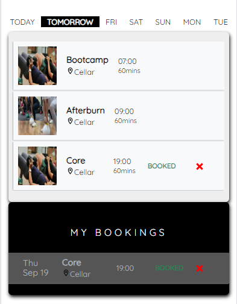

A static site built with Bridgetown to showcase the Rails application Membership System Pro

<br>

### Geberal Bridgetown Commands
```sh
# running locally
bin/bridgetown start

# build & deploy to production
bin/bridgetown deploy

# load the site up within a Ruby console (IRB)
bin/bridgetown console
```